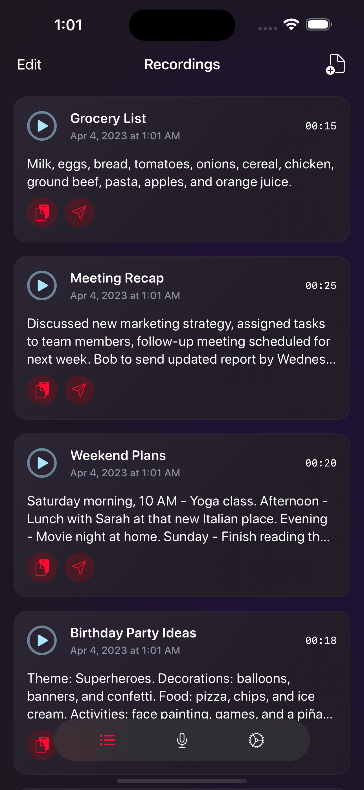
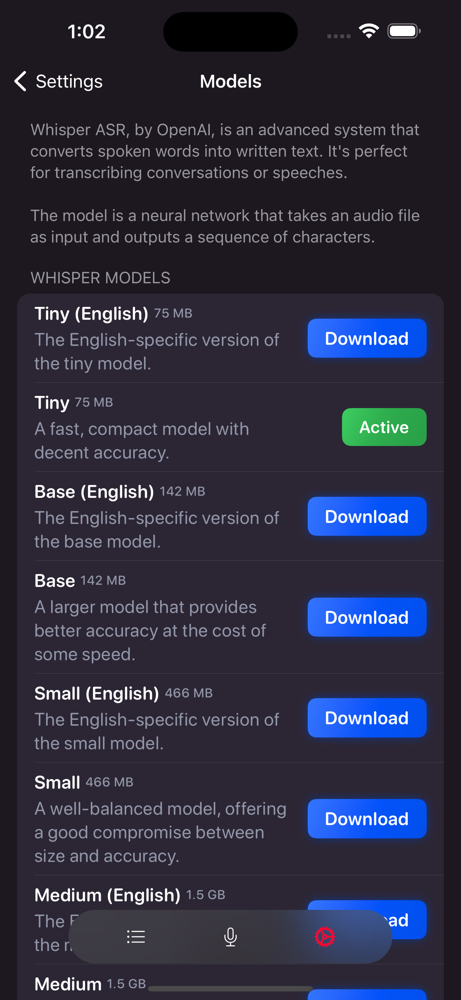

  

  <h3 align="center">Whisperboard</h3>

  

    An iOS app for recording and transcribing audio on the go, based on OpenAI's Whisper model.
  

    
    
    
    
    

## Features

- Easy-to-use voice recording and playback
- Transcription of recorded audio using Whisper from OpenAI
- Import and export audio files
- Select microphone for recording
- Model selection screen with the ability to download any Whisper model

## Future Plans

- [ ] Optimize the transcription process by eliminating silent portions of audio, which can reduce the processing time and improve overall efficiency.
- [x] Implement resumable transcription so that users can continue transcribing after the app has been terminated during the transcription process.
- [ ] Provide an estimated time remaining for the transcription to complete, helping users plan accordingly.
- [ ] Implement real-time transcription using smaller, more efficient models, offering users faster results.

## Installation

1. Clone this repository
2. Run `make`
3. Open the project in Xcode

## License

This project is licensed under the GPL-3.0 license.

The Poppins and Karla fonts used in project are licensed under the SIL Open Font License.

## Links

- [whisper.cpp](https://github.com/ggerganov/whisper.cpp)
- [OpenAI Whisper](https://github.com/openai/whisper)
- [The Composable Architecture](https://github.com/pointfreeco/swift-composable-architecture)
